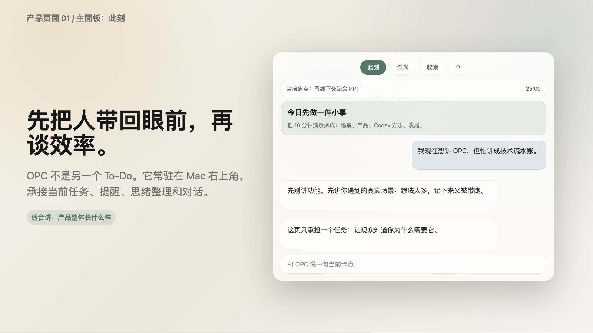
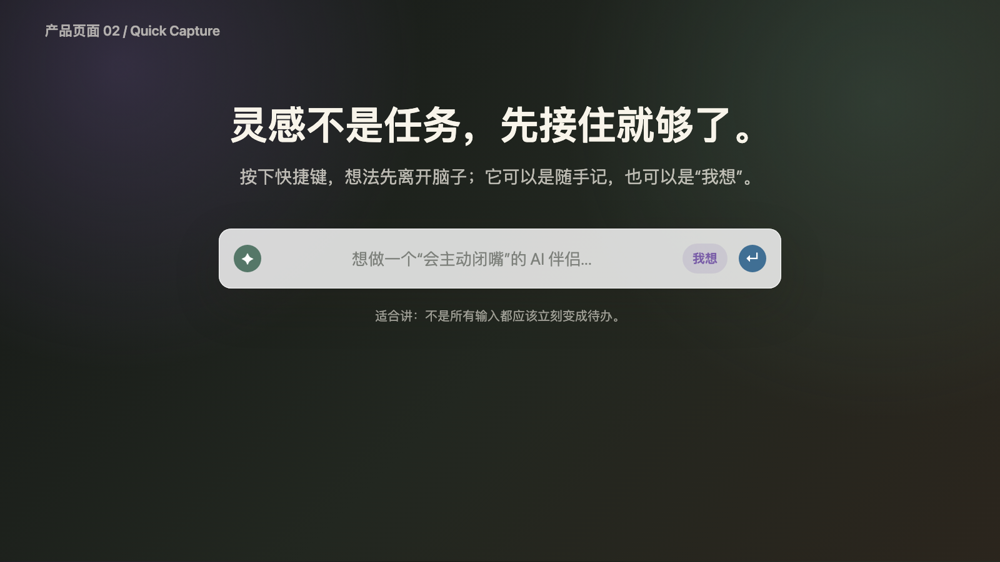
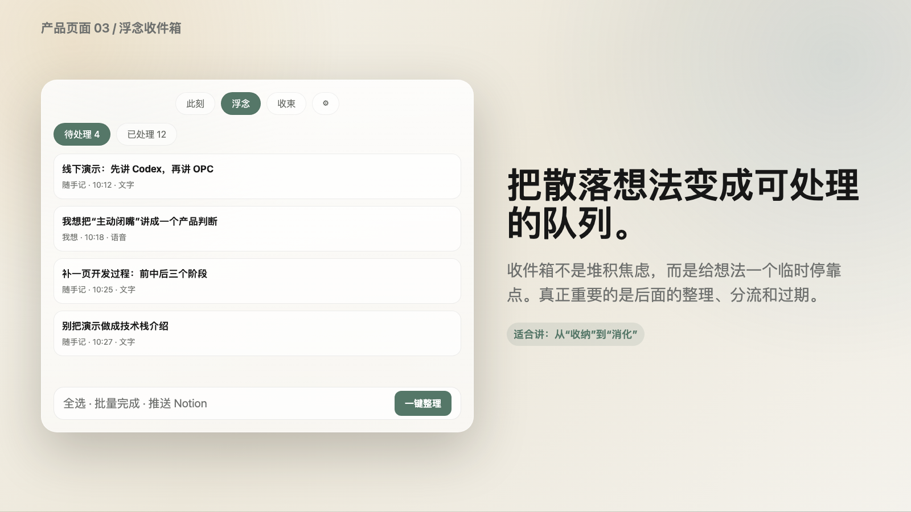
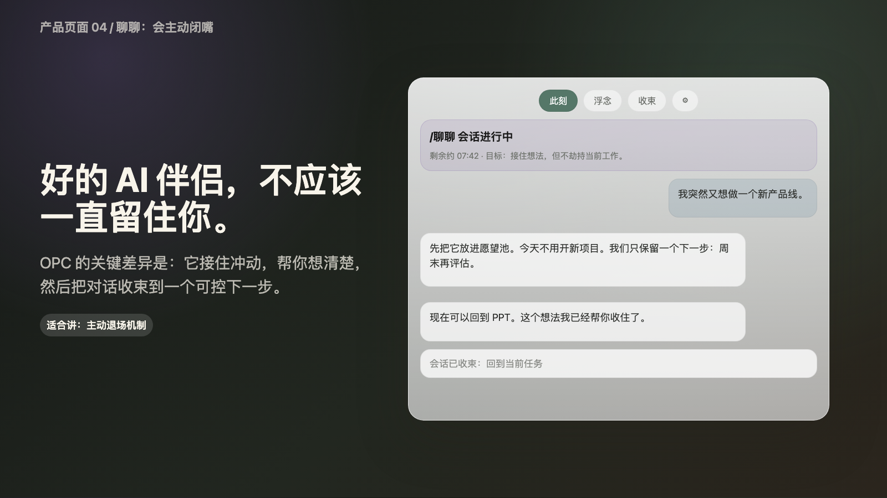
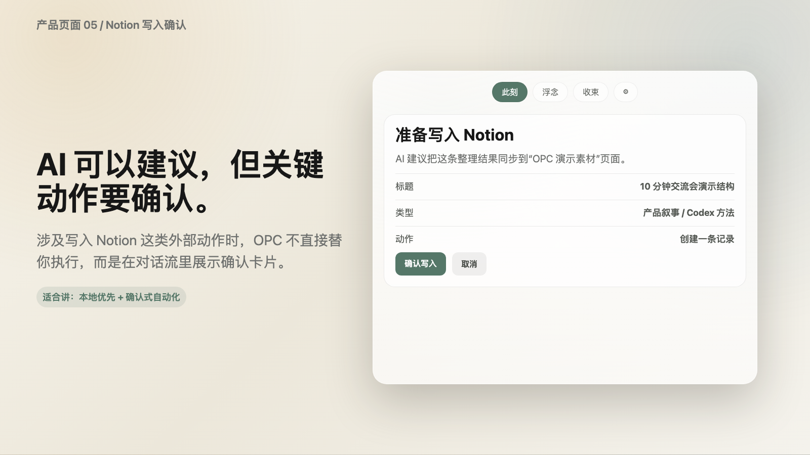

# OPC 伴侣

[English](README_EN.md) | 简体中文

> **人人都是 OPC，做自己人生的助理人。**

屏幕角落的私人思绪整理场 —— 一个**会闭嘴**的 macOS 菜单栏 AI 助手。

按一下热键，接住脑子里刚冒出来的东西；需要时它展开成一整张桌子，让你整理、对话、收束；不需要时，它就安静地缩回菜单栏，不抢你的注意力。

---

## 它不是什么，是什么

不是一个更强的 To-Do，也不是又一个聊天窗口。

OPC 伴侣是一个**思绪整理场**：把还没成形的念头、半句话、焦虑先接住，再决定要不要变成任务。它的高级感不来自装饰，而来自边界 —— 少说、短句、可撤回、可归档、会闭嘴。

它只在四种时刻出现：你在专注做事、脑子里冒出东西、想法堆多了要分拣、一段工作结束要收束。

## 核心能力

- **记一下** —— 热键唤起一根单行 bar，打字回车即接住（纯本地、不走 AI、不打扰当前工作）
- **聊聊** —— 与「整理员」对话：短句、不喊口号、每个回合都有出口
- **浮念 → 清扫 → 收束** —— 捕获、分拣、逐条决策、安静收尾的完整闭环
- **任务与专注** —— 计时、Pomodoro 循环、深度专注（联动系统勿扰）
- **双入口模式** —— Quiet Field 前门（折叠 bar，向下卷帘展开）/ 经典面板，设置里一键切换
- **记忆与归档** —— daily note、跨日对话主线、周报、长期画像
- **Notion / 语音 / 多主题** —— Notion 读写（写操作必经确认）、语音速记与朗读、多套主题与字体

## 核心界面

### 1. 此刻：先把人带回眼前

OPC 伴侣不是另一个 To-Do。它先帮你确认眼前最重要的事，再把对话收束到一个可以继续执行的下一步。



### 2. Quick Capture：灵感不是任务，先接住

按下快捷键，把刚冒出来的想法留在本地。它不会立刻变成待办，也不会打断你正在做的事。



### 3. 浮念收件箱：把散落想法变成可处理的队列

想法先进入收件箱，之后再统一整理、分流、完成或删除。收件箱不是堆积焦虑，而是给想法一个临时停靠点。



### 4. 聊聊：好的 AI 伴侣会主动闭嘴

当一次整理已经足够，OPC 伴侣会帮你把对话收束到下一步，然后把注意力还给当前任务。



### 5. Notion 写入确认：AI 可以建议，关键动作要确认

涉及写入外部系统时，OPC 伴侣不会静默替你执行。每次写入都先展示确认卡片。



## 技术栈

Swift 6 · SwiftUI + AppKit（NSPanel / NSStatusItem）· Swift Package Manager · macOS 15+
后端：OpenAI-compatible Chat Completions（流式 + function calling）· Notion API v1 · 凭证存 macOS Keychain

内置支持：MiniMax、DeepSeek、通义千问、OpenAI、Anthropic、SiliconFlow，以及自定义 OpenAI-compatible API。每个服务商的 API Key 分开存储，切换时不会互相覆盖。Anthropic 当前通过其官方 OpenAI SDK 兼容层接入，适合快速使用和对比测试。

## 隐私边界

OPC 伴侣把数据分成两条互不混淆的路径，使用前请知悉：

- **记一下（随手记）= 纯本地**：热键捕获的内容只写入本机 `~/.opc-companion/`，**不联网、不发送给 AI**。
- **聊聊（对话）= 会外发上下文**：为了让助手「记得你」，每次对话默认会把以下本地内容拼进请求发送给**你在设置中选择的 AI 服务商**——长期记忆（MEMORY.md）、用户画像（USER.md）、近几天的 daily note、最近一期周报，以及当前任务/收件箱状态；对话中触发的记忆检索、Notion 查询结果也会回传给模型以生成回复。
- **凭证**：API key 与 Notion token 存于 macOS Keychain，绝不明文落盘、绝不写入仓库。

一句话：**不想外发的，用「记一下」接住、别在「聊聊」里说。**

## 安装

目前**只有 macOS 版本**，要求 macOS 15 或更高版本。当前采用源码构建安装，暂未提供经过 Apple 公证的 DMG 安装包。

### 方法一：复制一条命令

打开「终端」，粘贴下面整行命令并回车：

```bash
/bin/bash -c "$(curl -fsSL https://raw.githubusercontent.com/Shiye-10Pages/OPC-Companion/feature/focused-conversation-memory/scripts/install.sh)"
```

脚本会下载源码、编译、安装到 `~/Applications/OPCCompanion.app`，然后自动启动。如果系统弹出 Xcode Command Line Tools 安装窗口，先完成安装，再重新执行同一条命令。

也可以把下面这段话直接发给你常用的 AI 编程助手：

```text
请帮我在这台 Mac 上安装 OPC 伴侣。执行下面的命令，遇到报错时解释原因并继续处理：
/bin/bash -c "$(curl -fsSL https://raw.githubusercontent.com/Shiye-10Pages/OPC-Companion/feature/focused-conversation-memory/scripts/install.sh)"
```

### 方法二：下载 ZIP 后安装

1. 点击 [下载 OPC 伴侣源码 ZIP](https://github.com/Shiye-10Pages/OPC-Companion/archive/refs/heads/feature/focused-conversation-memory.zip)。
2. 双击 ZIP 解压。
3. 打开「终端」，输入 `cd `，把刚解压的文件夹拖进终端窗口，然后回车。
4. 粘贴 `./scripts/install-local.sh` 并回车。
5. 首次启动后，点击菜单栏气泡图标，进入设置，选择任意一个支持的 AI 服务商并填写 API Key。Notion Token 是可选项。

如果 macOS 阻止首次打开，请前往「系统设置 → 隐私与安全性」，找到 OPCCompanion 并点击「仍要打开」。

### 开发者构建

```bash
swift build                 # 开发构建
./build.sh && open OPCCompanion.app   # 打包成 .app 并运行
swift test                  # 跑单元测试
```

## 关于十页AI

OPC 伴侣 由 **十页AI** 打造。

我们相信：好的 AI 助手不该一直对你说话，而该帮你把生活整理清楚，然后闭嘴。如果这句话戳到你，欢迎来：

- 小红书：**十页AI**（`naiyoubaba`）
- 社群：与一群在用 AI 重塑工作流的人一起折腾
- 更多产品与方法论：[shiyeai.cn](https://shiyeai.cn/)

> 用 OPC 伴侣，成为那个能替自己人生做整理的人。

## 许可

本项目采用 **PolyForm Noncommercial License 1.0.0**（专为源代码设计的非商业许可）。
你可以自由学习、修改、分发，用于任何**非商业**目的，但**须保留版权署名「十页AI」（许可中的 `Required Notice:` 行）、不得用于商业目的**。详见 [LICENSE](LICENSE)。
